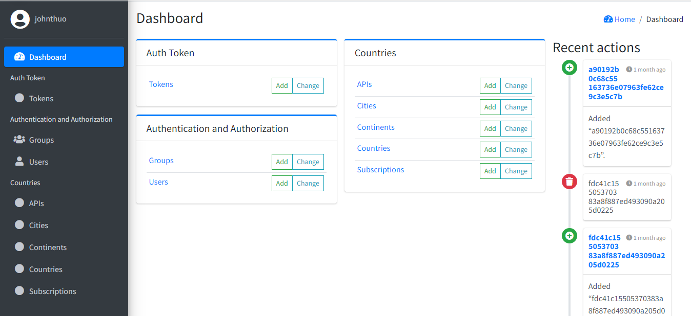

# worldrestapi

The system is a repository of cities around the world, a user first calls the continents API to get a list of continents, they then use the content id to call the countries API to get the countries linked to the specific continent, they then use the country’s id to call the cities’ API to get the cities linked to that specific country. 
These three APIs are the core APIs, below are the other APIs to be developed.  

•	Subscription API – an API responsible for subscribing a user to a particular API  
•	Get Subscriptions API - an API responsible for returning the APIs a user has subscribed to  
•	Unsubscribe API – an API responsible for unsubscribing a user from an API  
•	Get API - an API responsible for returning all APIS the system supports  

                   API Endpoints Table
| API                              |   Endpoint                                     |
|----------------------------------|:----------------------------------------------:|
|Create or Register New User ID    |	http://127.0.0.1:8000/api/users/create        |
|Log In API	                       | http://127.0.0.1:8000/api/users/login          |
|Get all system APIs and their ids |	http://127.0.0.1:8000/api/ |
|Subscribing to an API	           | http://127.0.0.1:8000/api/subscribe/api_id /   |
|Unsubscribing from an API         |	http://127.0.0.1:8000/api/unsubscribe/api_id/ |
|Subscribed APIs                   | http://127.0.0.1:8000/api/subscribed/          |
|Get Continents API	               | http://127.0.0.1:8000/api/continents/          |
|Get Countries API	               | http://127.0.0.1:8000/api/country/continent_id/|
|Get Cities API	                   | http://127.0.0.1:8000/api/cities/country_id/   | 

Use Postman to conduct the various API tests.

# World API User Interface Dashboard < br />

